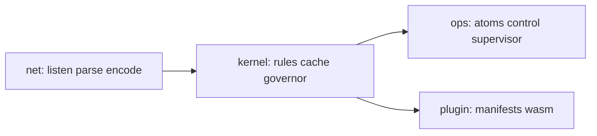
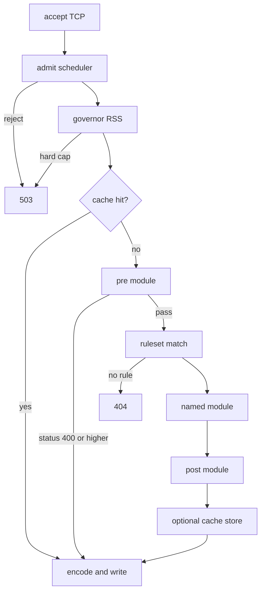
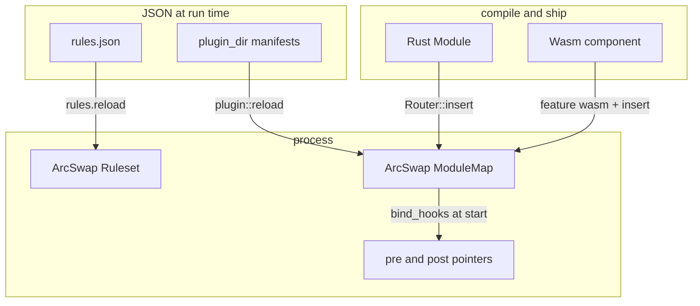
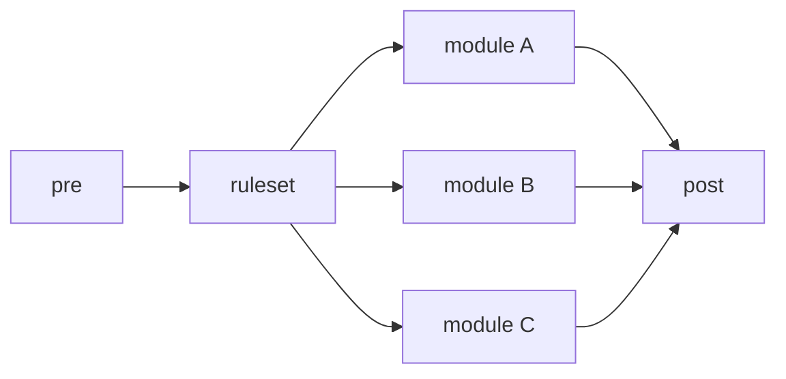
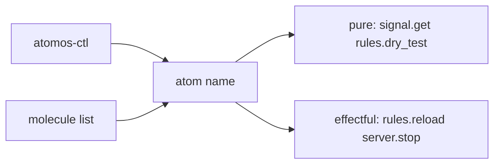
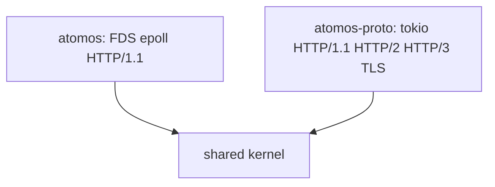

# Architecture

Atomos is a kernel plus a ruleset plus named modules. The kernel does not embed application routes. A consumer inserts modules. JSON selects one module per request.

## Planes



| Plane | Role |
|---|---|
| kernel | `In` / `Out`, disjoint rules, response cache, memory governor, scheduler |
| net | Listen, parse, encode. HTTP/1.1 on FDS epoll. HTTP/2 and HTTP/3 on tokio |
| ops | Atoms, molecules, Unix control, supervisor, key daemon |
| plugin | Directory manifests. Wasm slot. Native `.so` is refused |

Pinned workers accept, parse, and write on their own core. Do not block the request path. Put blocking work in the consumer.

The H1 engine runs one FDS reactor per pinned worker. It binds FDS TCP listeners with `SO_REUSEPORT`. Per-connection HTTP state is a slot array indexed by the FDS `ConnectionId`.

HTTP/1.1 keep-alive uses the encoded byte cache. HTTP/2 and HTTP/3 use the semantic `Out` cache with the same epoch.

## Request path



Cache-hit GET does not run pre, rules, module, post, or a plugin.

## Precondition and postcondition

Flags travel `pre → module → post` in a `u32` set (`FLAG_LOG`, `FLAG_METRICS_SKIP`, `FLAG_NO_POST`, `FLAG_DEGRADED`).

| Stage | Precondition | Postcondition |
|---|---|---|
| admit | Peer on an accepted socket | Queue slot held, or 503 |
| governor | Slot held | Continue, `FLAG_DEGRADED`, or 503 |
| cache | No hard block | Wire bytes returned, or miss |
| pre | Cache miss. Optional hook | Status 400 or higher returns. Else flags copy onto `In` |
| rules | Pre passed or absent | One module name, or 404. Header rule may return 401 / 403 |
| module | Name present in the module map | `Out` owned by the caller |
| post | `FLAG_NO_POST` clear. Optional hook | Status 0 skips merge. Else headers append. Non-empty body replaces. Non-200 status replaces |
| cache store | `CacheDirective` is not `No` | Entry stored under the worker cache bound |

Pre is a firewall, auth, or scheduler hook. Pre must not allocate on the H1 path. Pre must not block the worker.

Post is a header or observability hook. Post sees the original request. Post must not block the worker.

Set names in config:

```
"pre_module": "pre",
"post_module": "post"
```

The names must already be inserted on the router. `Router::bind_hooks` copies them.

Templates: `Code/templates/module_pre.rs`, `module_post.rs`.

## Hot-swap



| Surface | Swap without restart | How |
|---|---|---|
| Ruleset | Yes | `rules.reload` / `refresh-endpoints` reads JSON and swaps the `Arc` |
| Module map | Yes | `Router::insert` is `ArcSwap`. Plugin reload re-reads `plugin_dir` |
| Pre / post hooks | Bind at start | Config names. Call `bind_hooks` after insert |
| Rust module source | No | Compile the consumer and ship a new binary |
| Wasm component | Yes when built with `feature = "wasm"` | Manifest `kind: wasm` plus `plugin::reload` |
| Native `.so` | Never | Refused. Not a sandbox |

The ruleset is disjoint at load time. Overlap is an error. There is no regex.

Adding a path is an edit of JSON and a reload. Adding a Rust module is a new binary. Point a new path at an existing module name without a rebuild.

## Modules between the hooks



Each rule names one module. Modules do not call each other. A molecule is a list of atoms on the control plane. It is not an HTTP pipeline.

| Kind | Trait | Path |
|---|---|---|
| Sync | `Module` | H1 and proto |
| Async | `AsyncModule` | proto `dispatch_async` |
| Stream | `AsyncStreamModule` | proto HTTP/2 and HTTP/3 only |

## Atoms and molecules

Atoms are the mutation API. A pure atom that writes the world is a defect.



See [Atoms.md](Atoms.md) and [Control.md](Control.md).

## Two engines, one kernel



FDS crates live in `Code/FDS`. Do not change FDS control flow, types, or syscalls in this tree.

See [Compile.md](Compile.md) for the host build. See [Modules.md](Modules.md) and [Rules.md](Rules.md) for the consumer API.
