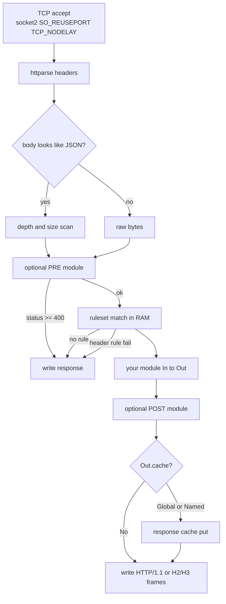
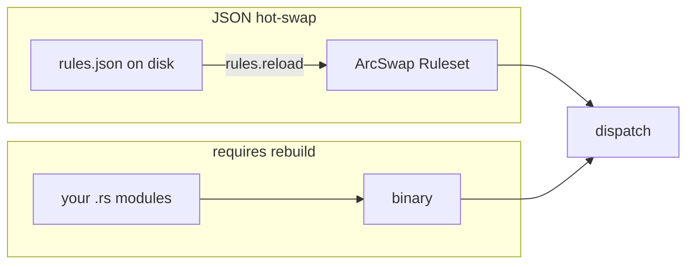
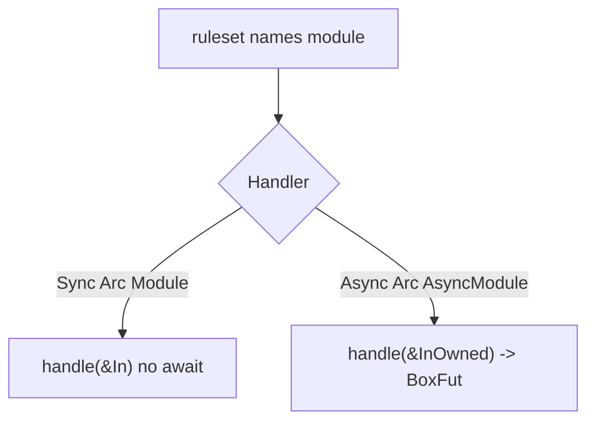
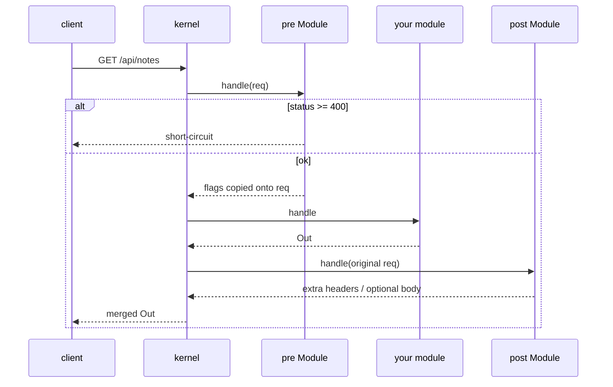
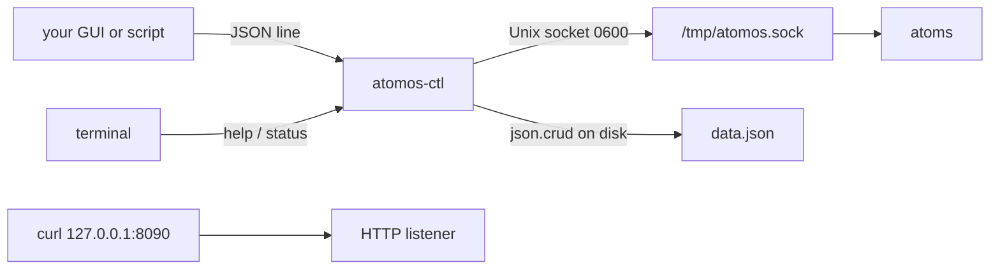
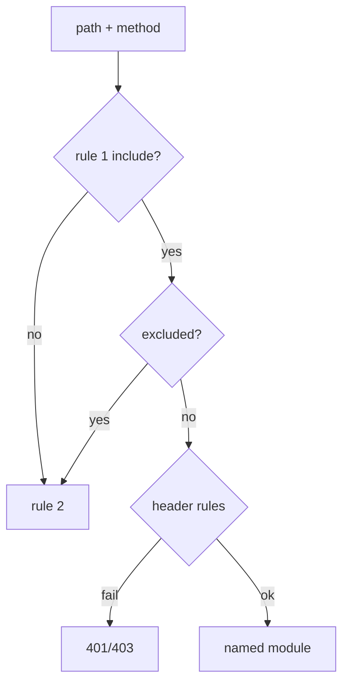

# Your first ATOMOS web app

This is the beginner path through the whole kernel: three JSON APIs, a
disjoint ruleset, pre/post hooks, global in-memory state, boot-time load,
response cache, and the operator CLI. Everything here is real code in this
crate. Nothing is stubbed as “imagine if”.

Worked example: `examples/first_app.rs` plus files under
`examples/first_app/`. Copy that pattern into your own crate when you outgrow
the example. Measured rps / latency / RSS: [bench-first-app.md](bench-first-app.md).

Default listen is **127.0.0.1:8090**. Skip extra ports with `refuse_ports` /
`.atomos/host.json`.

---

## 0. What ATOMOS is

ATOMOS is an HTTP **kernel**, not a framework and not a product.

You write **modules** (`In` → `Out`). You write a **ruleset** JSON that maps
`(method, path)` to exactly one module. The kernel accepts TCP, parses
headers, scans JSON depth, matches the ruleset, runs your module, optionally
caches the `Out`, and writes the response.

It is not axum. There is no regex router, no extractors, no middleware onion,
no reqwest. Pre/post are two optional `Module`s you register on the `Router`.

```
Consumer crate
  registers named modules
  loads rules.json
  owns global state (Arc)
  calls atomos::serve::run

Kernel crate (this repo)
  listen / parse / match / cache / write
  Unix control socket
  atoms (json.crud, rules.reload, server.*)
```

---

## 1. Mental model



Cache lookup happens **before** pre. A cached `GET /api/health` does not
re-run your module.



**Hot-swap = JSON rules and JSON data files.** Rust modules, pre, post, and
in-memory state live in the process until you restart the binary. There is
no `.so` reload.

---

## 2. Build this machine

`/tmp` is noexec on XENOT. Host `RUSTFLAGS` may inject mold. Always:

```bash
unset RUSTFLAGS
export CARGO_TARGET_DIR=$HOME/.cache/atomos-target
cd ~/Projects/Atomos
cargo test --offline
```

lld + RELRO come from `.cargo/config.toml` (generated by
`scripts/cpu-rustflags.sh` from `/proc/cpuinfo` — AVX2 on this host, never
hardcoded Broadwell, never AVX-512).

---

## 3. Run the first app

Terminal A:

```bash
unset RUSTFLAGS
export CARGO_TARGET_DIR=$HOME/.cache/atomos-target
cargo run --release --example first_app -- 127.0.0.1:8090
```

Terminal B:

```bash
curl -sS http://127.0.0.1:8090/
curl -sS http://127.0.0.1:8090/api/health
curl -sS http://127.0.0.1:8090/api/notes
curl -sS -H 'content-type: application/json' \
  -d '{"text":"hello"}' http://127.0.0.1:8090/api/notes
```

Operator CLI (not a full-screen TUI):

```bash
cargo run --release --bin atomos-ctl -- \
  --config examples/first_app/config.json --data examples/data.json
```

You get a `>` prompt. `help`, `status`, `refresh`, `quit`. JSON-lines for a
GUI:

```bash
echo '{"cmd":"status"}' | cargo run --release --bin atomos-ctl -- \
  --config examples/first_app/config.json --json
```

Operator ctl is CLI / JSON only.

Control socket for this example is **`/tmp/atomos-first.sock`**, not TCP 8090.

---

## 4. The three endpoints

| Method | Path | What | Cache | State |
|---|---|---|---|---|
| `GET` | `/api/health` | `{ok, uptime_ms}` | Global 1 s | `Instant` at boot |
| `GET` | `/api/notes` | notes + hit counter | none | `RwLock<Vec<Note>>` |
| `POST` | `/api/notes` | append `{text}` | none | same `RwLock`, cap 256 |

Plus static files on `GET/HEAD /*` except `/api/*` (the landing HTML).

That split is the whole routing story: **two rules**, **two module names**
(`static`, `api`). The API module then switches on `(method, path)` itself.
The kernel does not nest routers.

```json
{
  "rules": [
    {
      "id": "static",
      "module": "static",
      "methods": ["GET", "HEAD"],
      "include": ["/*"],
      "exclude": ["/api/*"]
    },
    {
      "id": "api",
      "module": "api",
      "methods": ["GET", "POST"],
      "include": ["/api/*"],
      "exclude": []
    }
  ]
}
```

`exclude` punches a hole so `/*` and `/api/*` do not overlap. Overlap at load
is a hard error (`RuleError::Overlap`). No regex. Patterns are exact (`/x`)
or prefix (`/api/*` meaning `/api/` + rest). `**`, `?`, `[` are rejected.

Add a third module the same way: a new `id`, a new `include` that does not
collide, `modules.insert("name", Handler::…)`.

---

## 5. A consumer `main` in one page

```rust
let (mut router, ctx, _) = atomos::static_router(cfg, rules);
{
    let r = std::sync::Arc::get_mut(&mut router).expect("unique");
    r.modules.insert("api".into(), Handler::Async(Arc::new(Api { state })));
    r.pre = Some(Arc::new(Pre { state: state.clone() }));
    r.post = Some(Arc::new(Post));
}
tokio::spawn(atomos::control::serve_control(sock, ctx.clone()));
atomos::serve::run(router, ctx).await?;
```

`static_router` already registered `"static"`. You add the rest **before**
`serve::run`. `Arc::get_mut` works only while you still own the unique
`Arc<Router>`.

Config keys `"pre_module"` / `"post_module"` are **names for you**. The
kernel does not auto-wire them from JSON. You must set `router.pre` /
`router.post`. If you forget, pre/post simply never run.

---

## 6. `In` and `Out`

Request (`src/io.rs`):

- `method`, `path`, `query`, `headers`, `body`, `peer`, `flags`
- Strings on `In<'_>` borrow the receive buffer
- `AsyncModule` gets `InOwned` (copied path/headers/body) because the future
  cannot keep the buffer borrow

Response:

| Field | Meaning |
|---|---|
| `status` | `Status::OK`, `NOT_FOUND`, `CREATED`, … |
| `reason` | `None` → RFC phrase |
| `headers` | extra pairs; kernel adds Content-Length |
| `body` | `Raw` (files) or `Json` (already serialized bytes) |
| `cache` | `No` (default) / `Global { ttl_ms }` / `Named { ruleset, ttl_ms }` |
| `flags` | bitset for post (`FLAG_LOG`, `FLAG_NO_POST`, `FLAG_DEGRADED`, …) |

JSON bodies: use `atomos::json_out::to_bytes(&value)` (thread-local `Vec`,
then `Bytes::copy_from_slice`). Do not `format!` integers on the write path;
the kernel uses `itoa`.

Helpers: `Out::json(status, bytes)`, `Out::raw(status, bytes, content_type)`,
`Out::empty(status)`.

---

## 7. Sync vs async modules



- **Sync `Module`**: static files, CPU-light. `In<'_>` borrows the buffer.
- **Async `AsyncModule`**: you need `.await` (almost never for a first app).
  The accept loop always calls `dispatch_async`, which can run either kind.

Blocking CPU (parse a big blob, walk a vec) belongs in `tokio::task::spawn_blocking`
or rayon, **not** on the accept worker. Upstream HTTP belongs on a bounded
queue in **your** crate, never on the request path.

Templates: `templates/module_sync.rs`, `templates/module_async.rs`.

---

## 8. Pre and post



**Pre** (`templates/module_pre.rs`):

- Runs after parse, before ruleset
- Status ≥ 400 stops the request (auth, firewall, loopback-only)
- Otherwise the router copies `Out.flags` onto `req.flags`
- `first_app` pre: increment a hit counter, reject non-loopback, set `FLAG_LOG`

**Post** (`templates/module_post.rs`):

- Sees the **original request**, not the module `Out` (today)
- Status `0` skips merge entirely (headers would be dropped)
- Return **200** + extra headers + empty body to **append** headers
- Non-empty body replaces the module body
- Non-200 status replaces the module status
- Skip with `FLAG_NO_POST` on the request or the module `Out`
- `first_app` post: `X-Atomos: first-app` on every response that ran post

Header rules on a **rule** (not pre) can require a header:

```json
"headers": [{ "name": "key", "exists": true, "on_fail": 401 }]
```

See `examples/first_app/rules-keyed.json`. CIDR is only `127.0.0.0/8`
(loopback check). After you copy that file over `rules.json`, run
`atomos-ctl refresh` (hot-swap). `curl` without `key:` then gets 401.

---

## 9. Global state

The kernel has no “app state” bag. You own it.

```rust
struct State {
    notes: parking_lot::RwLock<Vec<Note>>,
    hits: AtomicU64,
    started: Instant,
}
let state = Arc::new(State { … });
```

Put `Arc<State>` on every module that needs it (`Pre`, `Api`). That is the
whole pattern.

Rules:

- Never put a `Mutex` on the search/request path that can block. `parking_lot`
  + short critical sections, or `try_lock` and skip.
- Cap collections (`first_app` notes ≤ 256, text ≤ 512 bytes).
- Atomics for counters (`hits`).
- `Instant` / `ArcSwap` for config snapshots.

`AtomCtx` is the kernel’s own global: signal (on/off/restarting), rules
`ArcSwap`, `stop` flag, `allow_write`. Do not stuff product data in there.

---

## 10. Loading into memory vs caching vs mmap

Three different things. Do not mix the words.

### A. Boot load (your RAM)

`first_app` reads `notes.json` **once** at startup into `RwLock<Vec<Note>>`.
`POST /api/notes` mutates RAM only. Restart loses posts unless you persist.

Use this for small catalogs, feature flags, HTML snippets, key lists you
already own.

### B. Response cache (kernel)

If `Out.cache = CacheDirective::Global { ttl_ms: 1000 }`, the kernel stores
the **whole Out** keyed by `(method, path, query)`. Next identical GET is
served without the module.

Bounds: `cache_entries`, `cache_bytes` in config. `try_lock` only — under
contention it skips. TTL 0 means do not store.

`GET /api/health` in `first_app` is cached 1 s. `GET /api/notes` is not
(you would serve a stale list).

`Named { ruleset, ttl_ms }` is the same store today (the name is not a
separate map). Prefer `Global` until you split caches yourself.

### C. mmap large files (your crate)

For multi-gigabyte corpora, mmap in **your** crate. Do not
walk the whole file at boot. ATOMOS itself mmaps nothing of yours; the
static module opens files per request (and then the response cache may keep
the `Out`).

### D. What not to do

- Do not parse the full JSON body with serde until the depth scan passed
  (the kernel already scanned `{`/`[` bodies).
- Do not keep an unbounded `HashMap` of responses in your module. Use
  `Out.cache`.
- Do not load a 3 GB dump into a `Vec` at start. mmap + shard.

---

## 11. Hot-swap (what actually reloads)

| Thing | Hot? | How |
|---|---|---|
| `rules.json` | yes | control command `refresh-endpoints` → atom `rules.reload` → `ArcSwap` |
| `data.json` keys | yes | `json.crud` writes the file; next `keys list` reads it |
| Config TCP/bind | no | restart the process |
| Rust module code | no | rebuild |
| `router.pre` / `post` | no | rebuild |
| RAM `State` | no | your process; persist yourself |
| Static files | kind of | next uncached GET hits disk |

```bash
# edit examples/first_app/rules.json then:
atomos-ctl --config examples/first_app/config.json refresh
# or JSON:
echo '{"cmd":"refresh"}' | atomos-ctl --config examples/first_app/config.json --json
```

Dry-test before swap:

```bash
atomos-ctl --config examples/first_app/config.json dry-test
```

Two overlapping `GET /*` rules → `{ ok: false, a, b, example_path }`.

`server.stop` / `start` / `restart` flip cache-line-aligned atomics. They
do **not** spawn `atomos`. Stop = stop accepting after the current tick.
Start in this kernel is the signal going back to `on`; the accept loop
exits on `stop` and does not re-bind by itself. Treat restart as “signal
the supervisor / runit”, not “ctl forks a child”.

---

## 12. Operator CLI (command API for GUIs)

Default is a `>` prompt, argv commands, or JSON lines. No TUI.



Ctl **never** parses HTTP for control. It may TCP-connect to `bind` only to
answer “is HTTP up?” when the Unix socket is missing.

| Command | JSON | Side effect |
|---|---|---|
| `status` / `ping` | `{"cmd":"status"}` | read `signal.get` via UDS |
| `keys list` | `{"cmd":"keys.list"}` | read data file |
| `keys add [note]` | `{"cmd":"keys.add","note":"lab"}` | `json.crud` add `/keys/-` |
| `keys del i --yes` | `{"cmd":"keys.del","index":0,"yes":true}` | `json.crud` del |
| `json dump` | `{"cmd":"json.dump"}` | pretty data file |
| `config` | `{"cmd":"config"}` | bind, socket, rules_path |
| `refresh` | `{"cmd":"refresh"}` | `rules.reload` |
| `backup` | `{"cmd":"backup"}` | `settings.backup` |
| `dry-test` | `{"cmd":"dry-test"}` | `rules.dry_test` |
| `restart --yes` | `{"cmd":"restart","yes":true}` | molecule stop+start **signal** |

Errors are named JSON, not raw `os error 13`:

```json
{
  "ok": false,
  "error": "permission_denied",
  "path": "/tmp/atomos.sock",
  "message": "permission denied opening /tmp/atomos.sock (mode 0600, same EUID only)"
}
```

`server_unreachable` means the **Unix socket** is missing or stale. If HTTP
is still listening, the envelope includes `http.listening: true` and a hint.
That is the usual “I thought this was port 8090” failure.

Socket mode is 0600, same EUID. Permission denied is graceful; ctl does not
panic.

`install-link` creates `$HOME/atomos` → this binary.

---

## 13. Atoms and molecules

Atoms are the **only** mutation API for the operator. Kind is Pure or
Effectful. A pure atom that writes the world is a defect.

| Name | Kind | Role |
|---|---|---|
| `signal.get` | pure | `{state: on\|off\|restarting}` |
| `json.pretty` | pure | pretty text, cap 1 MiB |
| `resource.get` | pure | `{rss_bytes, cpu_fraction, uptime_ms}` (`cpu` is 0.0 today) |
| `rules.dry_test` | pure | overlap report |
| `json.crud` | effectful | `add` / `put` / `del` JSON Pointer, files ≤ 8 MiB, tmp+rename |
| `settings.backup` | effectful | copy file |
| `server.start` / `stop` / `restart` | effectful | signal atomics |
| `rules.reload` | effectful | re-read `ctx.rules_path` |
| `tunnel.apply` | effectful | `{ok:false, error:"unconfigured"}` |

`allow_write: false` on `AtomCtx` turns effectful atoms into `PureActuate`.

A **molecule** is a named list of atom names. Built-ins:

```
server.restart  = ["server.stop", "server.start"]
ops.dashboard   = ["signal.get", "resource.get"]
```

Templates: `templates/atom_pure.rs`, `atom_effectful.rs`, `molecule.rs`.
Adding a **new** atom means editing `atom::dispatch` in a consumer fork or
this crate — there is no runtime atom registry file.

Control socket commands (`src/control.rs`) map to atoms:

| UDS `cmd` | Atom |
|---|---|
| `status` | `signal.get` |
| `refresh-endpoints` / `rules.reload` | `rules.reload` |
| `stop` / `start` / `restart` | `server.*` |
| `dry-test-rules` | `rules.dry_test` |

---

## 14. Config field catalog

`Config::from_json` / `load_path`. Missing `bind` → `127.0.0.1:8090`.
Non-loopback bind is an error unless `allow_non_loopback: true`.

| Field | Default | Notes |
|---|---|---|
| `bind` | `127.0.0.1:8090` | `host:port` |
| `allow_non_loopback` | false | cloudflared is the HTTPS edge |
| `workers` | 2 | min 1 |
| `backlog` | 1024 | listen backlog |
| `tcp_nodelay` | true | |
| `tcp_fastopen` | false | |
| `so_reuseport` | true | |
| `keepalive_secs` | 75 | |
| `max_header_bytes` | 16384 | |
| `max_body_bytes` | 262144 | min 1024 |
| `max_json_depth` | 32 | 1..=64 |
| `request_timeout_ms` | 45000 | |
| `memory_cap_bytes` | 6e9 | min 16 MiB; example uses 64 MiB |
| `memory_mode` | `hard` | `hard` → 503; `degrade` → `FLAG_DEGRADED` |
| `cpu_fraction` | 0.40 | (0,1]; `resource.get` reports observed share |
| `cache_entries` / `cache_bytes` | 4096 / 256 MiB | response cache |
| `pre_module` / `post_module` | null | names; `Router::bind_hooks` wires registered modules |
| `refuse_ports` | `[]` | bind list the kernel will not open |
| `rules_path` | `rules.json` | hot-reloadable |
| `control_socket` | `/tmp/atomos.sock` | mode 0600 |
| `static_root` | `static` | |
| `error_page` | `static/error.html` | `{{code}}` `{{phrase}}` `{{detail}}` |

Validate fails the process. Do not ship a config that binds `0.0.0.0` without
the flag.

---

## 15. Ruleset details

- Max 256 rules, pattern length ≤ 1024, must start with `/`
- Empty `methods` = all methods
- Match is O(number of rules), first match in file order
- `assert_disjoint` at load: shared method + a candidate path that hits both
- `rules.dry_test` atom: `{path}` file, or `{rules:[…]}`, or live snapshot



---

## 16. Static files, MIME, errors

`StaticMod` serves `static_root` with `index.html` for `/`. Cache-Control is
set on successful file hits (`CacheDirective::Global`). Missing file → 404
HTML from `ErrorPage`.

Placeholders in `error.html`: `{{code}}` `{{phrase}}` `{{detail}}`. Missing
file falls back to the builtin `src/error.html` (`ATOMOS` branding).

---

## 17. Governor, flags, listen

- RSS from `/proc/self/status` `VmRSS`
- `hard` + over cap → HTTP 503 before the module
- `degrade` + over cap → `FLAG_DEGRADED` on the request
- Listen: socket2, `SO_REUSEPORT`, `TCP_NODELAY`, optional TCP Fast Open
- Shared counters are `#[repr(C, align(64))]` (`src/align.rs`)
- Parse: httparse, then `scan_json` depth before serde

Flags (`src/flags.rs`): `FLAG_LOG`, `FLAG_METRICS_SKIP`, `FLAG_NO_POST`,
`FLAG_DEGRADED`.

---

## 18. Feature map (every public surface you will touch)

| You want | Use |
|---|---|
| HTTP server | `serve::run` + `static_router` or your `Router` |
| A route | JSON rule + `modules.insert` |
| JSON API | `Module` (sync unless you `.await`) + `Out::json` + `json_out::to_bytes` |
| Files | module name `"static"` already in `static_router` |
| Auth header | rule `headers` or a pre module |
| Extra response header | post module |
| RAM catalog | `ArcSwap` snapshot; POST mutex + store + cache epoch |
| HTTP cache | `Out.cache = Global { ttl_ms }` |
| Huge read-only data | mmap in **your** crate |
| Operator GUI | `atomos-ctl --json` line protocol |
| Reload routes | `refresh-endpoints` |
| CRUD a JSON file | atom `json.crud` |
| Pretty JSON | atom `json.pretty` |
| Overlap check | `rules.dry_test` / `dry-test` |
| Copy-paste stubs | `templates/*.rs` and `templates/*.json` |

Examples already in-tree:

| Example | What |
|---|---|
| `static_site` | files only |
| `echo_api` | static + one echo module (no control socket) |
| `first_app` | three APIs, pre/post, RAM, cache, control socket |

---

## 19. What this kernel does **not** do

Say these out loud so you do not wait for them:

- No regex routes, no wildcards except trailing `/*`
- No `.rs` / `.so` hot reload
- No auto-wire of `pre_module` / `post_module` from config
- No `server.start` that execs a binary
- No remote TUI protocol
- No io_uring, no simd-json (measured slower here; not shipped)
- HTTP/2 (h2c + TLS) and HTTP/3 are on by default; loopback tiny-JSON H1 is still faster
- `resource.get` `cpu_fraction` is 0.0
- `tunnel.apply` is unconfigured
- Post does not receive the module `Out`, only the request
- CIDR allowlists: loopback only

---

## 20. Grow the first app (checklist)

1. Copy `examples/first_app.rs` into `your-crate/src/main.rs`.
2. Depend `atomos = { path = "../Atomos" }`.
3. Add a fourth path: new `match` arm **or** a new module + a new disjoint
   rule (never two rules that both match the same GET).
4. Need auth? Swap in `rules-keyed.json` and `refresh`, or put it in pre.
5. Need persist? After `POST`, `json.crud` / atomic write the notes file
   (effectful; cap 8 MiB on the atom).
6. Need upstream HTTP? Bounded channel + token bucket in **your** crate.
7. Need more cache? Set `CacheDirective` on GETs that are pure functions of
   path+query.
8. Point `atomos-ctl --config` at your config. Build a GUI on `--json`.

When a piece of this page disagrees with the code, the code in `src/` wins.
Keep this file honest.

---

## 21. File map for the first app

```
examples/first_app.rs              # modules + main
examples/first_app/config.json     # for atomos-ctl
examples/first_app/rules.json      # hot-reloadable
examples/first_app/rules-keyed.json
examples/first_app/notes.json      # boot-load into RAM
examples/first_app/static/index.html
examples/first_app/static/error.html
```

Read those files top to bottom after this guide. That is the whole course.
